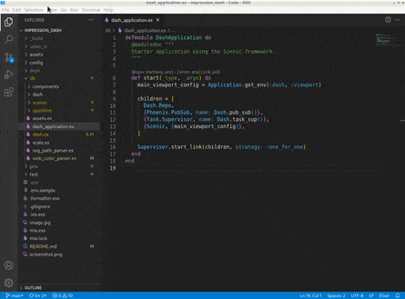

# ElixirLS: Elixir support and debugger for VS Code [](github/actions/workflow/status/elixir-lsp/vscode-elixir-ls/main.yml?branch=master)

Provides Elixir language support and debugger. This extension is powered by the [Elixir Language Server (ElixirLS)](https://github.com/elixir-lsp/elixir-ls), an Elixir implementation of Microsoft's IDE-agnostic [Language Server Protocol](https://github.com/Microsoft/language-server-protocol) and [VS Code debug protocol](https://code.visualstudio.com/docs/extensionAPI/api-debugging). Visit its page for more information. For a guide to debugger usage in Elixir, read [this blog post](https://medium.com/@JakeBeckerCode/debugging-elixir-in-vs-code-400e21814614).

Features include:

- Code completion
- Debugger support [VSCode debugging docs](https://code.visualstudio.com/docs/editor/debugging)
- Test discovery, running and debugging via Test Explorer [VSCode test API announcment](https://code.visualstudio.com/updates/v1_59#_testing-apis)
- Automatic, incremental Dialyzer analysis
- Automatic suggestion for @spec annotations based on Dialyzer's inferred success typings
- Diagnostic reporting of build warnings and errors
- Go-to-definition and Go-to-implementation
- Task provider with collection of mix tasks [VSCode tasks](https://code.visualstudio.com/docs/editor/tasks)
- Smart automatic closing of code blocks
- Documentation lookup on hover
- Function signature provider
- Code formatter (Triggered by `Alt + Shift + F` hotkey or enabling `editor.formatOnSave`)
- Find references to functions and modules
- Document and Workspace symbols provider
- Multi-root workspaces


## This is the main vscode-elixir-ls repo

The [elixir-lsp](https://github.com/elixir-lsp)/[vscode-elixir-ls](https://github.com/elixir-lsp/vscode-elixir-ls) repo began as a fork when the original repo at [JakeBecker](https://github.com/JakeBecker)/[vscode-elixir-ls](https://github.com/JakeBecker/vscode-elixir-ls) became inactive for an extended period of time. So we decided to start an active fork to merge dormant PR's and fix issues where possible. We also believe in an open and shared governance model to share the work instead of relying on one person to shoulder the whole burden.

The original repository has now been deprecated in favor of this one. Future updates to the original [VS Code ElixirLS extension](https://marketplace.visualstudio.com/items?itemName=JakeBecker.elixir-ls) will come from this repo.

## Default settings

ElixirLS is opinionated and sets the following default settings for Elixir files:

```jsonc
{
  // Based on Elixir formatter's style
  "editor.insertSpaces": true,
  // Note: While it is possible to override this in your VSCode configuration, the Elixir Formatter
  // does not support a configurable tab size, so if you override this then you should not use the
  // formatter.
  "editor.tabSize": 2,
  "files.trimTrailingWhitespace": true,
  "files.insertFinalNewline": true,
  "files.trimFinalNewlines": true,

  // Provides smart completion for "do" and "fn ->" blocks. Does not run the Elixir formatter.
  "editor.formatOnType": true,

  // Misc
  "editor.wordBasedSuggestions": false,
  "editor.trimAutoWhitespace": false
}
```

You can, of course, change these in your user settings, or on a per project basis in `.vscode/settings.json`.

## Advanced Configuration

### Add support for emmet

`emmet` is a plugin that makes it easier to write HTML: https://code.visualstudio.com/docs/editor/emmet

Open VSCode and hit Ctrl+Shift+P (or Cmd+Shift+P) and type "Preference: Open Settings (JSON)"
Add or edit your `emmet.includedLanguages` to include the new Language ID:

```json
"emmet.includeLanguages": {
  "html-eex": "html"
}
```

## Supported versions

See [ElixirLS](https://github.com/elixir-lsp/elixir-ls) for details on the supported Elixir and Erlang versions.

## Troubleshooting

If you run into issues with the extension, try these debugging steps:

- Make sure you have `hex` and `git` installed.
- Make sure `github.com` and `hex.pm` are accessible. You may need to configure your HTTPS proxy. If your setup uses TLS man-in-the-middle inspection, you may need to set `HEX_UNSAFE_HTTPS=1`.
- If ElixirLS fails to start, you can try cleaning the `Mix.install` directory. (The location on your system can be obtained by calling `Path.join(Mix.Utils.mix_cache(), "installs")` from an `iex` session.)
- Restart ElixirLS with a custom command `restart`
- Run `mix clean` or `mix clean --deps` in ElixirLS with the custom command `mixClean`.
- Restart your editor (which will restart ElixirLS).
- After stopping your editor, remove the entire `.elixir_ls` directory, then restart your editor.
  - NOTE: This will cause you to have to re-run the entire dialyzer build

You may need to set `elixirLS.mixEnv`, `elixirLS.mixTarget`, and `elixirLS.projectDir` if your project requires it. By default, ElixirLS compiles code with `MIX_ENV=test`, `MIX_TARGET=host`, and assumes that `mix.exs` is located in the workspace root directory.

If you get an error like the following immediately on startup:

```
[Warn  - 1:56:04 PM] ** (exit) exited in: GenServer.call(ElixirLS.LanguageServer.JsonRpc, {:packet, %{...snip...}}, 5000)
    ** (EXIT) no process: the process is not alive or there's no process currently associated with the given name, possibly because its application isn't started
```

and you installed Elixir and Erlang from the Erlang Solutions repository, you may not have a full installation of Erlang. This can be solved with `sudo apt-get install esl-erlang`. (This was originally reported in [#208](https://github.com/elixir-lsp/elixir-ls/issues/208).)

On fedora if you only install the elixir package you will not have a full erlang installation, this can be fixed by running `sudo dnf install erlang` (This was reported in [#231](https://github.com/elixir-lsp/elixir-ls/issues/231).)

If you are seeing the message "Invalid beam file or no abstract code", you need to make sure that your Mix project is set to use the `elixirc` compiler option `--debug-info`, which can be done by adding the following line to your `mix.exs` `project` section:

```
elixirc_options: [debug_info: Mix.env() == :dev]
```

For example:

```
defmodule MyApp.MixProject do
  use Mix.Project

  def project do
    [
      app: :my_app,
      version: "0.1.0",
      elixir: "~> 1.11",
      elixirc_paths: elixirc_paths(Mix.env()),
      elixirc_options: [debug_info: Mix.env() == :dev],
    ...
```

### Check ElixirLS Output

Check the output log by opening `View > Output` and selecting "ElixirLS" in the dropdown.



### Check the Developer Tools

Check the developer console by opening `Help > Toggle Developer Tools` and include any errors that look relevant.

## Experimental features

### Test code lenses

This feature allows ElixirLS to provide code lenses that help developers easily execute tests. This feature is currently
experimental because of a few known issues as well as a lack of large scale testing.

#### Example


#### Configuration

```jsonc
{
  // Enable or disable test lenses. Defaults to false.
  "elixirLS.enableTestLenses": true
}
```

## Contributing

### Installation

```shell
# Clone this repo recursively to ensure you get the elixir-ls submodule
git clone --recursive git@github.com:elixir-lsp/vscode-elixir-ls.git

# Fetch vscode-elixir-ls dependencies
cd vscode-elixir-ls
npm install

# Fetch elixir-ls dependencies
cd elixir-ls
mix deps.get
MIX_ENV=prod mix compile
```

To launch the extension from VS Code, run the "Launch Extension local" launch configuration from [Run and Debug view](https://code.visualstudio.com/docs/editor/debugging#_run-view) or press F5.

Alternatively, you can build and install the extension locally using the `vsce` command and the `code` CLI.

```shell
# Navigate to vscode-elixir-ls project root
cd ..

# Build the extension
npx vsce package

# Install it locally
code --install-extension *.vsix --force
```

Note that if you have the extension installed from the Visual Studio Marketplace and are also installing a locally
built package, you may need to disable the [Extensions: Auto Check Updates](https://code.visualstudio.com/docs/editor/extension-gallery#_extension-autoupdate) setting to prevent your
local install from being replaced with the Marketplace version.

### `elixir-ls` submodule

Most of the functionality of this extension comes from ElixirLS, which is included as a Git submodule in the `elixir-ls` folder. Make sure you clone the repo using `git clone --recursive` or run `git submodule init && git submodule update` after cloning.

Including `elixir-ls` as a submodule makes it easy to develop and test code changes for ElixirLS itself. If you want to modify ElixirLS, not just its VS Code client code, you'll want to change the code in the `elixir-ls` subdirectory. Most often you don't need to explicitly build it. The ElixirLS launch script should be able to pick up changes and rebuild accordingly via `Mix.install`.

When you're ready to contribute your changes back to ElixirLS, you need to fork the [ElixirLS](https://github.com/elixir-lsp/elixir-ls) repo on Github and push any changes you make to the ElixirLS submodule to your fork. Here is an example of how that might look:

```shell
# Enter the submodule directory. Now, if you run git commands, they run in the submodule
cd vscode-elixir-ls/elixir-ls

# Create your feature branch
git checkout -b my_new_branch

# Add your forked elixir-ls repository as a remote
git remote add my_fork git@github.com:<your_github_username>/elixir-ls.git

# Make changes in the elixir-ls folder, commit them, and push to your forked repo
git commit ...
git push my_fork my_new_branch

# Visit https://github.com/elixir-lsp/elixir-ls/compare to start a new Pull Request
```

### Running the tests locally

You should ensure that the tests run locally before submitting a PR, and if relevant add automated tests in the PR.

```shell
rm -rf out
npm run compile
npm test
```

Alternatively, you can use the `test.sh`/`test.bat` script which does the above.

## Acknowledgements and related projects

There is another VS Code extension for Elixir, [VSCode Elixir](https://github.com/fr1zle/vscode-elixir). It's powered by [Elixir Sense](https://github.com/msaraiva/elixir_sense), another language "smartness" server similar to ElixirLS. Much of this extension's client code (such as syntax highlighting) was copied directly from VSCode Elixir, for which they deserve all the credit.
